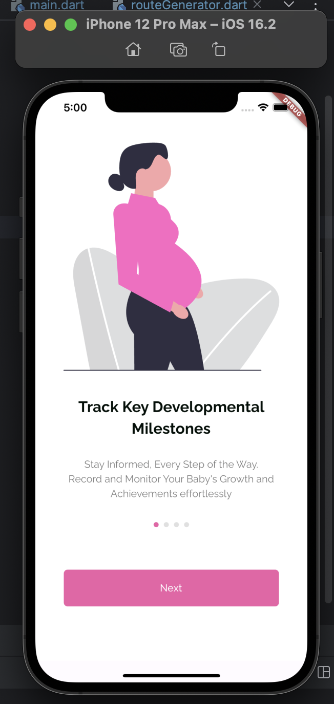
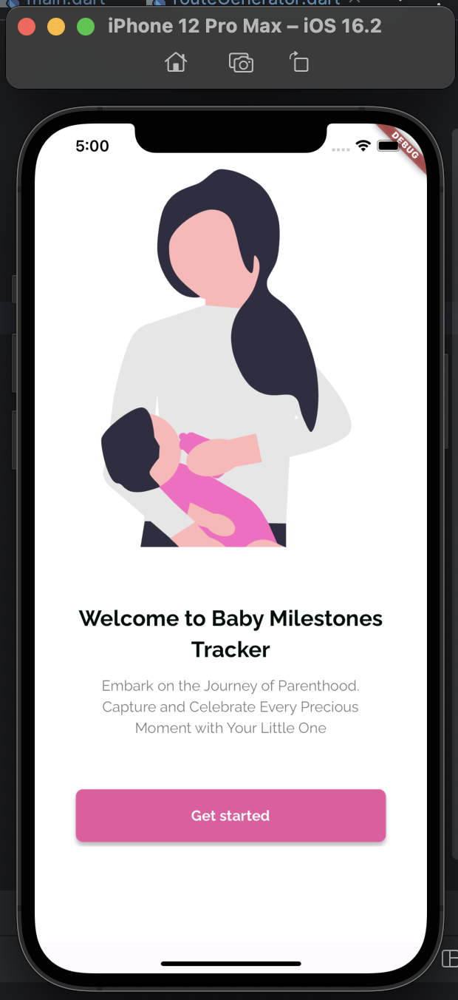
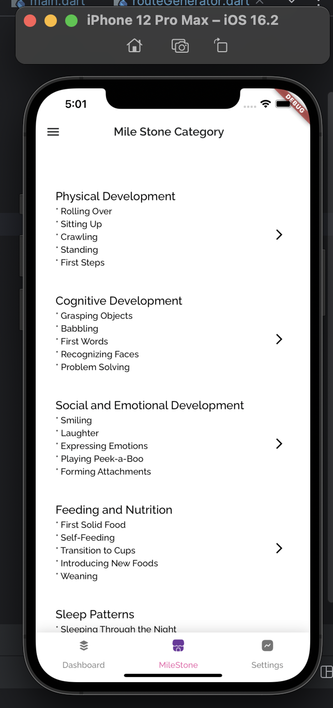
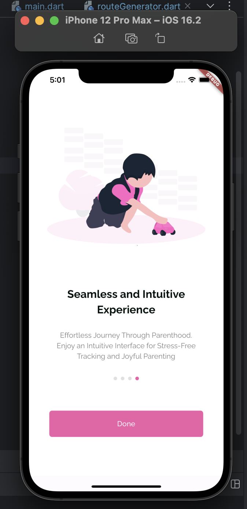
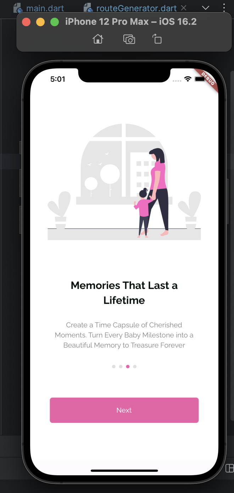
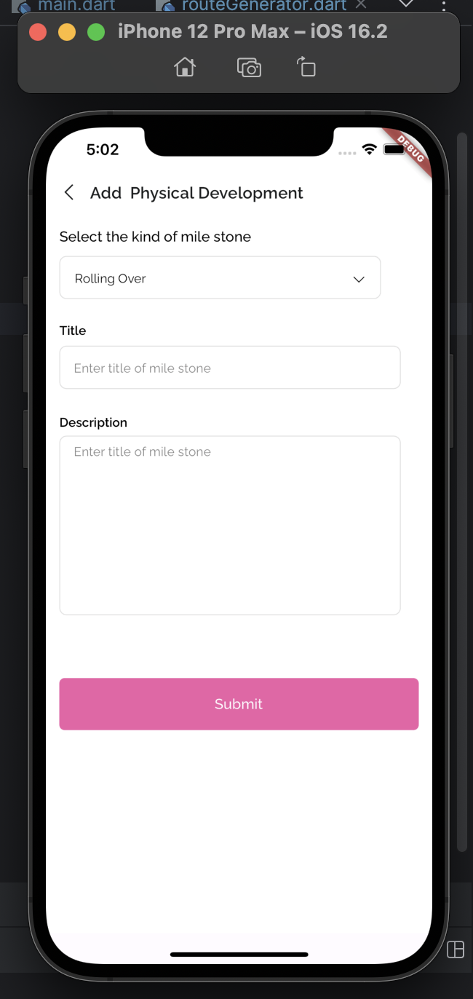
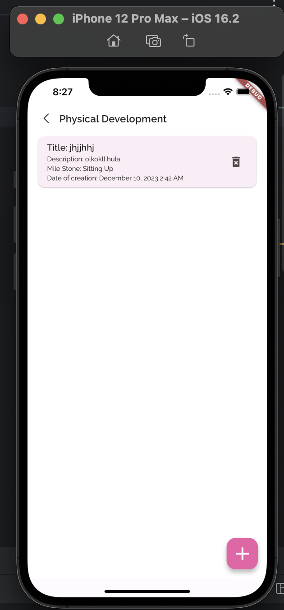
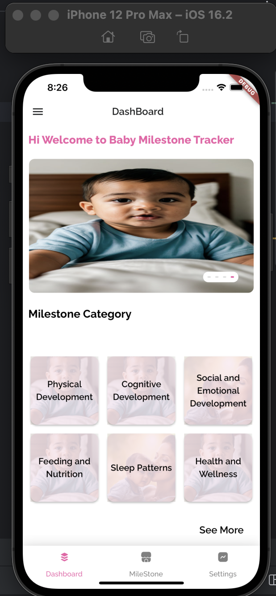

Certainly! If you are using the Stacked library for state management in your Flutter app, it's essential to mention it in your README to provide clarity for developers who may want to contribute or understand the project structure. Below is an updated section to include information about Stacked:

---

# Baby Milestones Tracker

## Overview

Baby Milestones Tracker is an application designed to help parents keep track of and celebrate their baby's developmental milestones. The app allows users to record and categorize various milestones, making it easy to reminisce and share these precious moments.

## Screenshots

<p align="center">
  
  
  
</p>


<p align="center">
  
  
  
</p>


<p align="center">
  
  
  
</p>

## Key Features

- **Category-Based Tracking**: Organize milestones into specific categories such as Physical Development, Cognitive Development, Social and Emotional Development, and more.

- **User-Friendly Interface**: Intuitive and visually appealing interface for easy navigation and interaction.

- **GridView Display**: Categories are presented in a GridView for a visually appealing overview of available milestones.

- **Detailed Milestone Information**: Each recorded milestone includes details such as title, description, type of milestone, and date of creation.

- **Human-Readable Dates**: Dates are formatted in a human-readable form for better user experience.

- **State Management with Stacked**: Efficient state management using the Stacked library.

## Technologies Used

- **Flutter**: The framework for building the cross-platform mobile app.

- **Hive Database**: Lightweight and fast NoSQL database for storing and retrieving milestone data.

- **intl Package**: Used for date formatting to present dates in a human-readable format.

- **Stacked State Management**: Efficient and reactive state management for Flutter applications.

## Getting Started

1. **Clone the Repository**:

   ```bash
   git clone https://github.com/angeloobeta/baby-milestones-tracker.git
   ```

2. **Navigate to the Project Directory**:

   ```bash
   cd baby-milestones-tracker
   ```

3. **Install Dependencies**:

   ```bash
   flutter pub get
   ```

4. **Run the App**:

   ```bash
   flutter run
   ```

5. **Explore the App**:

   Open the app on your emulator or physical device and start exploring the features.

## How to Contribute

If you would like to contribute to the project, please follow these steps:

1. Fork the repository.

2. Create a new branch:

   ```bash
   git checkout -b feature/your-feature-name
   ```

3. Make your changes and commit them:

   ```bash
   git commit -m "Add your feature"
   ```

4. Push your changes to your fork:

   ```bash
   git push origin feature/your-feature-name
   ```

5. Open a pull request.

## License

This project is licensed under the [MIT License](LICENSE).

## Acknowledgments

- Thanks to the Flutter, Hive, and Stacked communities for their fantastic tools and support.

- Special thanks to contributors who have helped make this project better.

---

This section provides a clear overview of the technologies used, with a specific mention of the state management library (Stacked) used in the project. Adjust the content as needed based on your project's specifics.